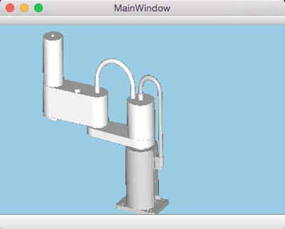

#SimpleRobot



##开发平台
* Qt5.4
* OpenGL ES 2.0
* Mac OS 10.10(实测同样可在Windows上正常工作)

##主要API使用
[详细文档](doc/html/index.html)
```cpp
// 移动主臂到指定角度
// angle: 角度
// speed: 速度1-100，-1表示继续以上次设定的值运动
// immediate: 是否立即到达，如果为true，则立即到达指定位置，speed无效
bool RotateMasterAbs(float angle, float speed=-1, bool immediate=false);
// 移动主臂指定大小的角度
// angle: 角度
// speed: 速度1-100，-1表示继续以上次设定的值运动
// immediate: 是否立即到达，如果为true，则立即到达指定位置，speed无效
bool RotateMaster(float angle, float speed=-1, bool immediate=false);
bool RotateAssistantAbs(float angle, float speed=-1, bool immediate=false);
bool RotateAssistant(float angle, float speed=-1, bool immediate=false);
bool RotateBarAbs(float angle, float speed=-1, bool immediate=false);
bool RotateBar(float angle, float speed=-1, bool immediate=false);
bool MoveBarAbs(float down, float speed=-1, bool immediate=false);
bool MoveBar(float down, float speed=-1, bool immediate=false);
// 指定控制的3D数据模型
void setModel(Model *model);
// 指定控制的3D视图
void setView(View *view);
// 动作完成时是否发送信号，注意，立即到达模式下永远不会发送信号
void setFinishedSignal(bool open);
```

##简单实例
mainwindow.cpp
```cpp
include "mainwindow.h"
#include "ui_mainwindow.h"
#include "robot.h"

MainWindow::MainWindow(QWidget *parent) :
    QMainWindow(parent),
    ui(new Ui::MainWindow)
{
    ui->setupUi(this);
    robot = new Robot();     //获取机器人实例
    view = robot->getView(); //获取3D视图
    control = robot->getControl(); //获取机器人控制器
    this->setCentralWidget(view);  //设置3D视图为当前窗口主视图

    connect(control, SIGNAL(actionFinished()),
            this, SLOT(onReached())); //连接动作完成信号
    control->setFinishedSignal(true); //打开动作完成信号
}

MainWindow::~MainWindow()
{
    delete ui;
}

//按键响应函数
void MainWindow::keyPressEvent(QKeyEvent *event)
{
    bool immediate = false;
    // 如果按住shift则立即到达位置
    if(event->modifiers() == Qt::ShiftModifier) immediate = true;
    switch (event->key()) {
    case Qt::Key_Left:
        view->rotateView(0,-10,0);
        break;
    case Qt::Key_Down:
        view->rotateView(10,0,0);
        break;
    case Qt::Key_Up:
        view->rotateView(-10,0,0);
        break;
    case Qt::Key_Right:
        view->rotateView(0,10,0);
        break;
    case Qt::Key_Q:
        control->RotateMaster(-40, 100, immediate);
        break;
    case Qt::Key_A:
        control->RotateMaster(40, 100, immediate);
        break;
    case Qt::Key_W:
        control->RotateAssistant(-40, 100, immediate);
        break;
    case Qt::Key_S:
        control->RotateAssistant(40, 100, immediate);
        break;
    case Qt::Key_E:
        control->RotateBar(-40, 100, immediate);
        break;
    case Qt::Key_D:
        control->RotateBar(40, 100, immediate);
        break;
    case Qt::Key_R:
        control->MoveBar(-40, 100, immediate);
        break;
    case Qt::Key_F:
        control->MoveBar(40, 100, immediate);
        break;
    case Qt::Key_U:
        control->RotateMasterAbs(-90, 50, immediate);
        break;
    case Qt::Key_J:
        control->RotateMasterAbs(90, 50, immediate);
        break;
    case Qt::Key_I:
        control->RotateAssistantAbs(-90, 50, immediate);
        break;
    case Qt::Key_K:
        control->RotateAssistantAbs(90, 50, immediate);
        break;
    case Qt::Key_O:
        control->RotateBarAbs(-90, 50, immediate);
        break;
    case Qt::Key_L:
        control->RotateBarAbs(90, 50, immediate);
        break;
    case Qt::Key_P:
        control->MoveBarAbs(40, 50, immediate);
        break;
    case Qt::Key_Semicolon:
        control->MoveBarAbs(0, 50, immediate);
        break;
    case Qt::Key_Space:
        control->Stop();
        break;
    default:
        QMainWindow::keyPressEvent(event);
        break;
    }
}

//动作完成槽
void MainWindow::onReached()
{
    qDebug()<<"Reached!";
}
```
具体示例请看项目代码。

#例子使用说明
在QTCreator中编译成功后运行。
* 方向键旋转视角    
* q, a旋转主臂，w, s旋转副臂，e, d旋转工具杆，r, f伸缩工具杆
* u, j旋转主臂到指定位置，i, k旋转副臂到指定位置，o, l旋转工具杆到指定位置， ;, p伸缩工具杆到指定位置
* 按住shift在按以上的键，指定部位立即到达指定位置，其他部位仍然正常运动。
* 空格键停止
